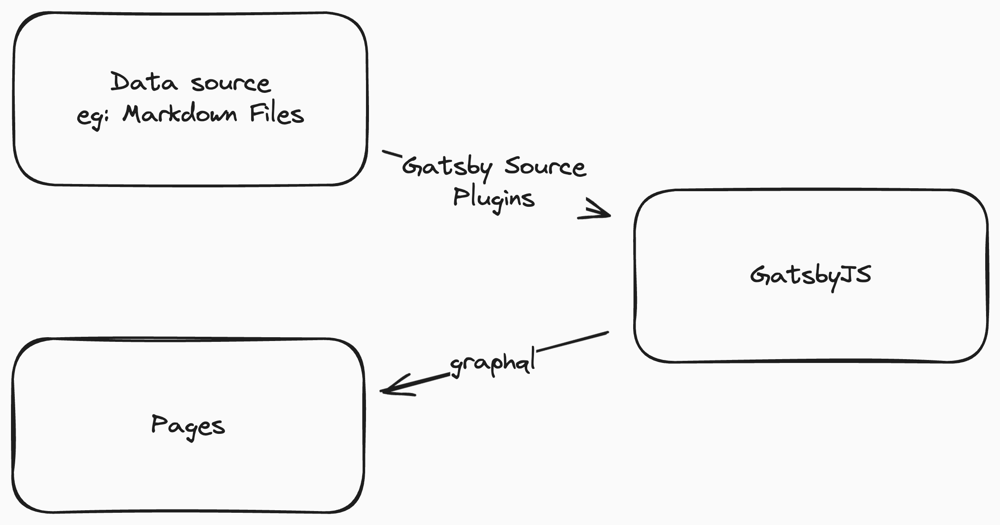

Recently I wanted to revamp my personal website. While in the quest for the **Ideal** template, I came found this super clean-looking
template by, [Narative](https://www.narative.co/) called, Novela.

[https://novela.narative.co/](https://novela.narative.co/)

But it seemed the theme dev stopped somewhere in 2019 and they have taken the repository offline with only leaving only an 
[npm package](https://www.npmjs.com/package/@narative/gatsby-theme-novela). I really wanted to build my personal website/blog 
using this theme, but again,I didn't want to base my blog on an unmaintained Gatsby theme from NPM (which) doesn't have a public repository.

So I took matters into my own hands and created my own fork and ported it to the latest React and Gatsby versions. While doing this, 
I learned a lot about GatsbyJS and how it works. So I thought of sharing my experience with you all.

## What is GatsbyJS?

GatsbyJS is a framework for building static websites. Gatsby is powered by several popular technoliges like React, graphql and 
webpack. In essence, GatsbyJS lets you provide data in several formats and let's you render websites using the data as static websites.
The journey starts with data sourcing.

## Data Sources

GatsbyJS allows you to provide data in several different formats such as,
- Markdown Files
- MDX Files
- Via CMS like,
    - Contentful
    - WordPress
    - Drupal

I just mentioned a few. Not only that, Gatsby simply allows you to create your own source plugin as well and has a very good documentation
on how to do it.

[Creating a Source Plugin](https://www.gatsbyjs.com/docs/tutorial/creating-a-source-plugin/)

Once you configure a source plugin, GatsbyJS sources the data provided and exposes the data via GraphQL. This data can be queried by pages
for rendering information.

## Lifecycle APIs

Once the data is sourced, the data might not be ready for rendering just yet. Gatsby provides multiple lifestyle hooks
which gets executed at different stages of the build process. These hooks can be used to transform the data, create new pages, etc.

One example case would be the [onCreateNode](https://www.gatsbyjs.com/docs/reference/config-files/gatsby-node/#onCreateNode) API which
gets executed when a new node is created. This can be used to transform the data before it gets exposed via GraphQL. 

Another important hook is the [createPages](https://www.gatsbyjs.com/docs/reference/config-files/gatsby-node/#createPages) hook which
gets executed after the data is sourced and transformed. This hook can be used dynamically to create pages from the sourced data.

The below documentation lists down all the lifecycle hooks available in GatsbyJS and when they get executed.

[Bootstrap sequence](https://www.gatsbyjs.com/docs/conceptual/gatsby-lifecycle-apis/#bootstrap-sequence)

## Rendering Content

Once the data is sourced and transformed, the next step is to render the content. You can use React components to render the content.
GatsbyJS provides a way to create pages using React components. When creating pages in the `createPage` hook, you can provide react
components as the template for the page. You can check out the examples in the official documentation.

[creatingPages](https://www.gatsbyjs.com/docs/reference/routing/creating-routes/#using-gatsby-nodejs)

## Plugins

Although I just explained the most basic concepts of Gatsby, there is so much more to GatsbyJS. Apart from all the Gatsby built-in
features, there are a lot of plugins available that can be used to extend the functionality of GatsbyJS. You can find the plugins
in the official [GatsbyJS plugin library](https://www.gatsbyjs.com/plugins). For example, you can use 

[emotion-plugin](https://www.gatsbyjs.com/plugins/gatsby-plugin-emotion#gatsby-plugin-emotion)

to use emotion CSS in your Gatsby project which helps adding css in js.

## Conclusion

Gatsby is a very powerful tool for building static websites. It has very good documentation and very good community support, not to mention
a bunch of plugins are available to extend the functionality. If you are looking to build a static website, GatsbyJS is a very good choice. You can checkout
my fork of the Novela theme which I used for my personal website below,

[github-novela](https://github.com/sudaraka94/gatsby-theme-novela)

[node-novela](https://www.npmjs.com/package/@sudaraka94/gatsby-theme-novela)
